# Claude Code 权限钩子插件项目

> **🏠 项目根目录** | **📅 更新时间**: 2025-12-23 15:34:56

## 项目愿景

构建安全的 Claude Code 命令执行环境，通过智能权限钩子系统拦截危险操作，并引导用户使用更安全的内置工具和 MCP (Model Context Protocol) 服务。

## 🏗️ 项目架构概览

```mermaid
graph TD
    %% 主要组件
    A["(根) Claude Code 权限钩子插件项目"] --> B["bash-permission-hook"];
    A --> C["web-permission-hook"];
    A --> D["win-path-check-hook"];
    A --> E[".claude"];
    A --> F[".claude-plugin"];
    A --> G["scripts"];

    %% Bash 模块详情
    B --> B1["scripts/check-command.js"];
    B --> B2["config/config.json"];
    B --> B3["hooks/hooks.json"];

    %% Web 模块详情
    C --> C1["scripts/check-command.js"];
    C --> C2["config/config.json"];
    C --> C3["hooks/hooks.json"];

    %% Win Path 模块详情
    D --> D1["scripts/check-path.js"];
    D --> D2["hooks/hooks.json"];

    %% 配置模块
    E --> E1["rules/constitution.md"];
    E --> E2["settings.local.json"];

    %% 插件市场
    F --> F1["marketplace.json"];

    %% 部署脚本
    G --> G1["deploy-plugin.ps1"];
    G --> G2["deploy-plugin.sh"];

    %% 样式定义
    click B "./bash-permission-hook/CLAUDE.md" "查看 bash-permission-hook 模块文档"
    click C "./web-permission-hook/CLAUDE.md" "查看 web-permission-hook 模块文档"
    click D "./win-path-check-hook/CLAUDE.md" "查看 win-path-check-hook 模块文档"

    style A fill:#e1f5fe
    style B fill:#f3e5f5
    style C fill:#f3e5f5
    style D fill:#f3e5f5
    style E fill:#e8f5e8
    style F fill:#fff3e0
    style G fill:#fff3e0
```

## 📋 模块索引

| 模块名称 | 路径 | 功能描述 | 状态 | 📖 详细文档 |
|----------|------|----------|------|------------|
| **Bash Permission Hook** | [`bash-permission-hook/`](./bash-permission-hook/CLAUDE.md) | Bash 命令权限控制与智能拦截 | ✅ 生产就绪 | [模块文档](./bash-permission-hook/CLAUDE.md) |
| **Web Permission Hook** | [`web-permission-hook/`](./web-permission-hook/CLAUDE.md) | Web 工具权限控制与 MCP 替代 | ✅ 生产就绪 | [模块文档](./web-permission-hook/CLAUDE.md) |
| **Win Path Check Hook** | [`win-path-check-hook/`](./win-path-check-hook/CLAUDE.md) | Windows 路径兼容性检查 | ✅ 生产就绪 | [模块文档](./win-path-check-hook/CLAUDE.md) |

## 🗂️ 详细模块结构

### 📁 [bash-permission-hook](./bash-permission-hook/CLAUDE.md)
**🔧 主要插件模块** - 实现 Bash 命令权限控制

> 🏠 [模块文档 →](./bash-permission-hook/CLAUDE.md)

- ****核心入口****: `scripts/check-command.js` - 命令处理逻辑
- ****配置系统****: `config/config.json` - 拦截规则定义
- ****钩子配置****: `hooks/hooks.json` - Claude Code 钩子注册
- ****插件元数据****: `.claude-plugin/plugin.json` - 插件信息

### 📁 [web-permission-hook](./web-permission-hook/CLAUDE.md)
**🌐 Web 插件模块** - 实现Web工具权限控制

> 🏠 [模块文档 →](./web-permission-hook/CLAUDE.md)

- ****核心入口****: `scripts/check-command.js` - Web 工具处理逻辑
- ****配置系统****: `config/config.json` - 工具映射规则
- ****钩子配置****: `hooks/hooks.json` - Web 工具钩子注册
- ****插件元数据****: `.claude-plugin/plugin.json` - Web 插件信息

### 📁 [win-path-check-hook](./win-path-check-hook/CLAUDE.md)
**🪟 Windows 路径插件** - 跨平台路径兼容性

> 🏠 [模块文档 →](./win-path-check-hook/CLAUDE.md)

- ****核心入口****: `scripts/check-path.js` - 路径检查逻辑
- ****钩子配置****: `hooks/hooks.json` - Bash 工具钩子注册
- ****插件元数据****: `.claude-plugin/plugin.json` - 插件信息

---

### 📁 .claude
**⚙️ 全局配置与规则** - 项目开发规范

- ****规则文档****: `rules/constitution.md` - 核心规范与使用说明
- ****本地设置****: `settings.local.json` - Claude Code 本地配置
- ****扫描索引****: `index.json` - AI 上下文扫描记录

### 📁 .claude-plugin
**🔌 插件元数据** - 插件定义与市场信息

- ****市场配置****: `marketplace.json` - 插件市场注册信息
- ****插件文档****: `CLAUDE.md` - 插件配置中心说明

### 📁 scripts
**🛠️ 项目脚本** - 构建与部署工具

- ****部署脚本****: `deploy-plugin.ps1` / `deploy-plugin.sh` - 跨平台自动化部署
- ****构建工具****: 项目级别构建和脚本管理

## 📊 项目统计分析

### 📁 文件分布
- **总文件数**: 47 个文件（已过滤）
- **核心代码**: 3 个主要脚本文件
- **配置文件**: 8 个 JSON 配置
- **钩子配置**: 3 个 hooks.json
- **部署工具**: 2 个脚本文件 (.ps1/.sh)
- **文档资源**: 7 个 CLAUDE.md 文档

### 🔍 模块覆盖率
- **识别模块**: 3/3 (100%) ✅
  - bash-permission-hook ✅
  - web-permission-hook ✅
  - win-path-check-hook ✅
- **核心功能覆盖**: 100% ✅

## 🏛️ 全局开发规范

### 🔧 技术栈统一
- **运行时**: Node.js >= 14.0.0 (所有模块)
- **语言**: JavaScript (ES6+)
- **配置格式**: JSON

### 📝 代码规范
- ****注释风格****: 中文注释，保持与现有代码库一致
- ****命名约定****: 驼峰命名法，功能导向命名
- ****文件结构****: `scripts/ | config/ | hooks/ | .claude-plugin/`
- ****错误处理****: try-catch 包裹，失败时默认放行

### 🚀 部署规范
- ****关键原则****: 修改后必须同步到实际运行目录
- ****部署路径****: `~/.claude/plugins/cache/<市场>/<插件>/<版本>/`
- ****自动化工具****: 优先使用 `scripts/deploy-plugin.*` 脚本

### 🔐 安全原则
- ****最小权限****: 仅拦截明确危险的操作
- ****明确指导****: 提供清晰的替代方案提示
- ****错误安全****: 配置加载失败时默认放行
- ****兼容性保证****: 不影响非目标工具的正常使用

---

## 📈 项目总结

### 🎯 核心价值主张
本项目为 Claude Code 构建了**三层次权限控制体系**：

1. **🔧 Bash 层面**: 拦截危险系统命令，引导使用内置安全工具
2. **🌐 Web 层面**: 拦截原生网络工具，引导使用 MCP 服务生态
3. **🪟 路径层面**: 检测 Windows 路径兼容性问题，自动修正或提示

### 🏆 技术亮点
- **智能管道检测**: 区分命令使用上下文，精准拦截
- **可扩展架构**: 规则驱动配置，零代码扩展新功能
- **MCP 生态集成**: 向下一代工具生态平滑迁移
- **跨平台部署**: 自动化部署工具，Windows/Linux/macOS 全覆盖
- **路径兼容性**: 自动处理 Windows/Unix 路径差异

### 📊 覆盖的拦截场景

| 类别 | 工具/命令 | 推荐替代 | 状态 |
|------|-----------|----------|------|
| **文件搜索** | `find` | Glob 工具 | ✅ 已实现 |
| **内容搜索** | `grep` | Grep 工具 | ✅ 已实现 |
| **文件读取** | `cat/head/tail` | Read 工具 | ✅ 已实现 |
| **文件编辑** | `sed` | Edit 工具 | ✅ 已实现 |
| **文本处理** | `awk` | Grep + Read 组合 | ✅ 已实现 |
| **网络请求** | `WebFetch` | Fetch MCP | ✅ 已实现 |
| **网络搜索** | `WebSearch` | Search MCP | ✅ 已实现 |
| **路径问题** | Windows 反斜杠路径 | 自动修正/提示 | ✅ 已实现 |

### 🔧 当前支持的功能
- ✅ Bash 命令智能拦截与管道位置检测
- ✅ Web 工具权限控制与 MCP 替代引导
- ✅ Windows 路径兼容性检查与自动修正
- ✅ 可配置的规则系统和自动化部署
- ✅ 完整的文档体系和部署工具

### 📞 联系与支持
- **文档**: [项目模块文档](./bash-permission-hook/CLAUDE.md) | [Web 模块文档](./web-permission-hook/CLAUDE.md) | [Win Path 模块文档](./win-path-check-hook/CLAUDE.md)
- **规则说明**: [.claude/rules/constitution.md](./.claude/rules/constitution.md)
- **扫描索引**: [.claude/index.json](./.claude/index.json)

---

## 📋 变更记录 (Changelog)

### 2025-12-23 15:34:56
- ✨ 新增 win-path-check-hook 模块支持
- 📊 更新模块架构图，使用可点击的 Mermaid 图表
- 🔍 完成项目 AI 上下文初始化扫描
- 📈 统计文件覆盖率和模块状态
- 📝 新增 .claude/index.json 扫描记录文件

### 2025-12-22 10:13:44
- ✨ 初始版本创建
- 🏗️ 建立 bash-permission-hook 和 web-permission-hook 模块
- 📚 完善文档体系

---

> **🏠 [返回顶部](#claude-code-权限钩子插件项目)** | **📅 最后更新**: 2025-12-23 15:34:56