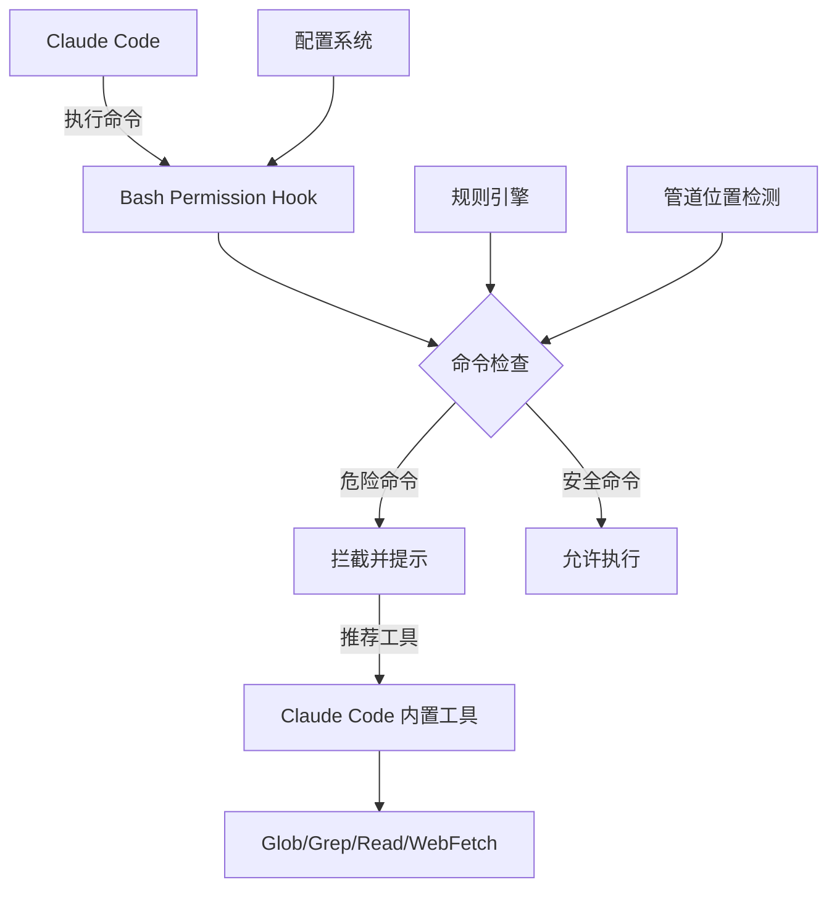

# Claude Code 权限钩子插件项目

## 项目概述

Claude Code 权限钩子插件项目，专注于构建安全的命令执行环境。项目核心功能是通过智能钩子系统拦截危险的 Bash 命令，并引导用户使用 Claude Code 内置的安全工具。

## 核心架构



## 模块结构

### 📁 bash-permission-hook
**主要插件模块** - 实现 Bash 命令权限控制

- **入口**: `scripts/check-command.js`
- **配置**: `config/config.json`
- **测试**: `tests/test.js`
- **钩子配置**: `hooks/hooks.json`

**核心功能**:
- 智能命令拆分与管道位置检测
- 基于规则的命令拦截
- 特殊场景处理（如管道中的 grep）
- 可配置的规则系统

### 📁 .claude
**全局配置与规则** - 项目开发规范

- **部署规则**: `rules/plugin-deployment-rule.md`
- **规则说明**: `rules/README.md`
- **本地设置**: `settings.local.json`

### 📁 .claude-plugin
**插件元数据** - 插件定义与市场信息

- **插件定义**: `plugin.json`
- **市场配置**: `marketplace.json`

### 📁 docs
**文档目录** - 设计文档与规范

- **设计文档**: `BASH_PLUGIN_DESIGN.md`

### 📁 scripts
**项目脚本** - 构建与部署工具

## 技术栈

- **运行时**: Node.js >= 14.0.0
- **语言**: JavaScript (ES6+)
- **配置格式**: JSON
- **测试框架**: 自定义测试套件

## 拦截规则

当前支持的危险命令拦截：

| 命令 | 推荐替代 | 说明 |
|------|----------|------|
| `find` | Glob 工具 | 内置模式匹配 |
| `grep` | Grep 工具 | 管道接收端放行 |
| `cat/head/tail` | Read 工具 | 智能文件读取 |
| `sed` | Edit 工具 | 原子性编辑 |
| `awk` | Grep + Read 组合 | 复杂文本处理 |
| `curl/wget` | WebFetch/WebSearch | 网络请求 |

## 智能特性

### 🎯 管道位置检测
- **智能识别**: 区分管道发起端与接收端
- **场景适配**: `echo "test" \| grep "test"` 允许执行
- **安全边界**: `grep "pattern" file.txt` 仍被拦截

### 🔧 可扩展规则系统
- **模式匹配**: 支持单命令和多词命令
- **动态配置**: JSON 配置文件实时生效
- **建议系统**: 为每个拦截规则提供替代方案

## 安装与部署

### 开发环境
```bash
# 运行测试
cd bash-permission-hook
npm test

# 手动测试
echo '{"tool_input": {"command": "echo \"test\" | grep \"test\""}}' | node scripts/check-command.js
```

### 生产部署
⚠️ **重要**: 修改后必须同步到实际运行目录

```powershell
# Windows 自动部署
.\.claude\rules\deploy-plugin.bat
```

## 开发工作流

1. **修改代码**: 在 `bash-permission-hook/` 目录开发
2. **本地测试**: 使用测试套件验证逻辑
3. **部署同步**: 将文件复制到插件运行目录
4. **验证生效**: 手动测试确认功能正常
5. **更新文档**: 同步更新相关文档

## 项目状态

- **当前版本**: v1.0.0
- **开发分支**: feature-bash
- **主要功能**:
  - ✅ 基础命令拦截
  - ✅ 管道位置智能检测
  - ✅ 可配置规则系统
  - ✅ 自动化部署脚本

## 贡献指南

1. 遵循现有的代码风格和注释规范
2. 添加新功能时同步更新测试用例
3. 修改配置文件后验证部署流程
4. 保持文档与代码同步

## 许可证

MIT License